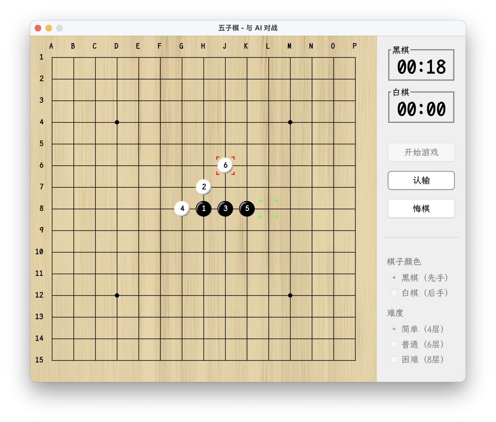

# Gomoku Game with AI

[中文](./README_ZH.md) | English

[](https://jdk.java.net/21/)
[](LICENSE)
[]()
[]()

<p align="center">
  
</p>

A Java-based Gomoku (Five in a Row) game with AI opponent.

> AI's current search depth is limited to 6 layers, improvements are ongoing.

<p align="center">
  
</p>

## Features & Implementation

### Core Features

- AI vs Human gameplay with three difficulty levels (Beginner-4, Amateur-6, Professional-8 depths)
- Game utilities: undo moves, timer, stone color selection
- Clean and intuitive interface

### Technical Features

1. **AI Decision System**
    - Iterative deepening Alpha-Beta pruning search
    - Position evaluation with pattern recognition and threat analysis
    - Fast pattern matching using Aho-Corasick automaton

2. **Performance Optimizations**
    - Heuristic move ordering for search efficiency
    - Position caching with Zobrist hashing
    - Efficient board representation (1D array, 15x15)
    - Object pooling for memory optimization

3. **Architecture**
    - Event-driven design using EventBus for UI-Logic decoupling

## Project Structure

```
src/main/java/cn/wxiach/
├── core/           # Game core logic
│   ├── model/     # Basic data models
│   ├── rule/      # Game rules
│   ├── state/     # Game state management
│   └── utils/     # Utilities
├── robot/         # AI implementation
│   ├── search/    # Search algorithms
│   ├── pattern/   # Pattern recognition
│   └── evaluate/  # Position evaluation
├── ui/            # User interface
│   ├── components/# UI components
│   ├── assets/    # Resources
│   └── support/   # UI support
└── event/         # Event system
```

## Requirements

- JDK 21 or higher
- Gradle 8.5 or higher

## Roadmap

- [ ] **Move Ordering Enhancement**: Implement history and killer heuristics to improve pruning efficiency
- [ ] **VCT Module**: Add Victory by Continuous Threats algorithm for critical positions
- [ ] **Opening Book**: Introduce standard opening moves database

## Contributing

Issues and Pull Requests are welcome.

## License

This project is licensed under the MIT License - see the [LICENSE](LICENSE) file for details.

## References

### Papers

1. Yu Cheng, Xiaofeng Lei. Research and Improvement of Alpha-Beta Search Algorithm in Gomoku[J]. Information Technology,
   2008(1):148-150.
2. Hongan Dong. Research and Implementation of Computer Gomoku Game System[D]. Xidian University, 2010.
